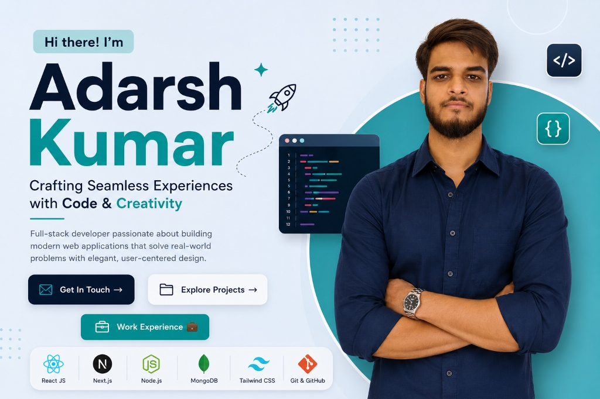
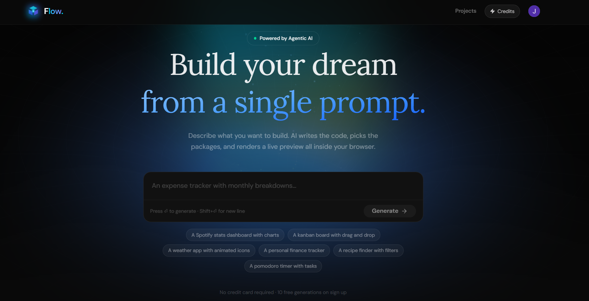
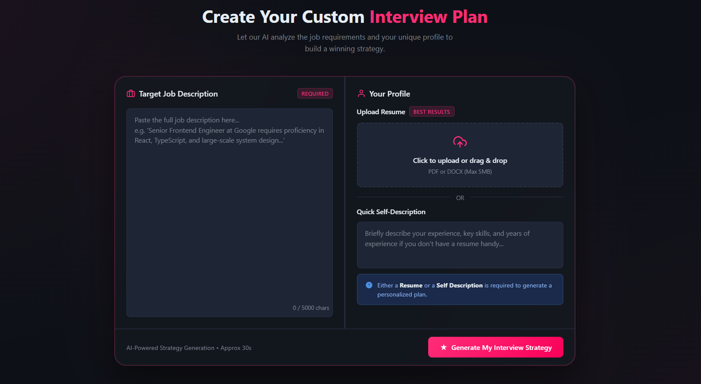
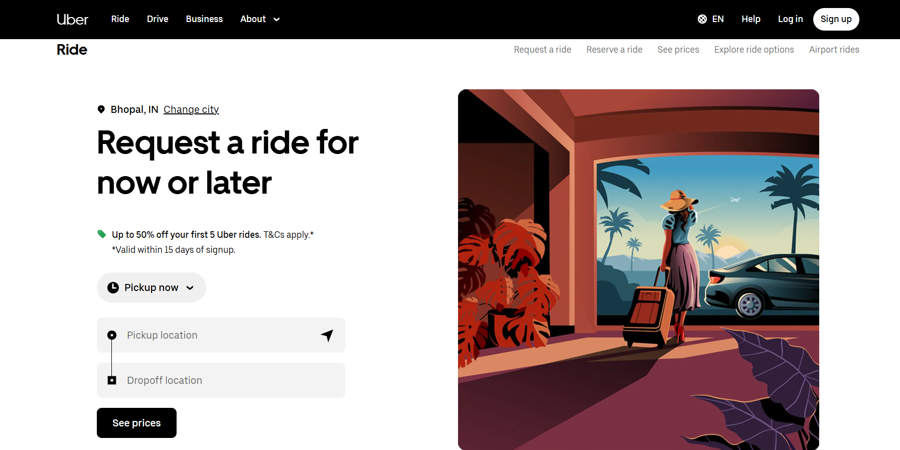
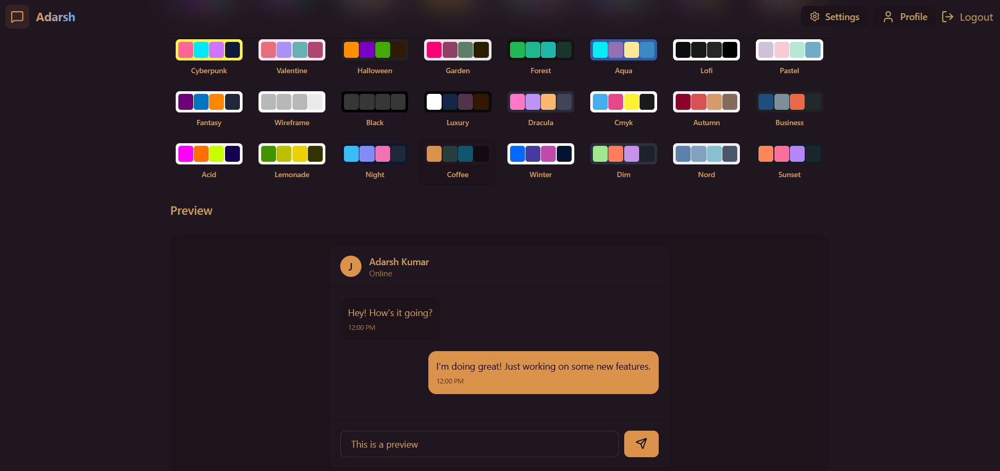
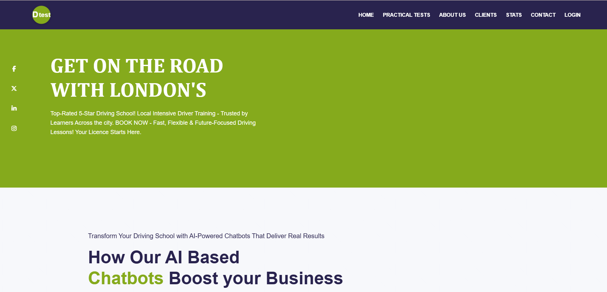
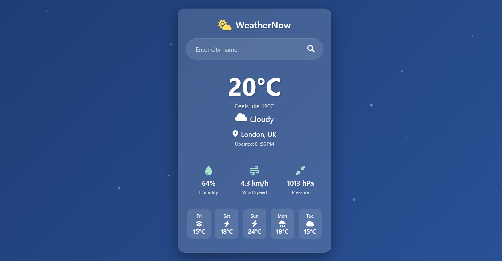

# 💻 Adarsh Kumar | Full-Stack Developer Portfolio

<p align="center">
  
</p>

<p align="center">
  <a href="https://www.linkedin.com/in/adarsh-kumar-b52276343/"></a>
  <a href="https://github.com/Adshkumar"></a>
  <a href="https://leetcode.com/u/Adarsh_kumar62041/"></a>
  <a href="https://x.com/Adarshsingh1a"></a>
  <a href="mailto:adarsh99733207@gmail.com"></a>
</p>

---

## 👤 About Me

Hello! I'm **Adarsh Kumar**, a passionate Full-Stack Developer based in **New Delhi, India**. I specialize in engineering modern, performant, and user-centric web applications. Currently, I am pursuing my undergraduate studies in **Computer Science** at **Chhotu Ram Rural Institute Of Technology** (2024–2027) while actively honing my problem-solving skills through Data Structures & Algorithms.

I love transforming complex challenges into elegant digital solutions with clean, structured code and dynamic visual aesthetics.

---

## 🛠️ Tech Stack & Skills

<table>
  <tr>
    <td align="center" width="25%">
      <strong>Frontend</strong>
    </td>
    <td align="center" width="25%">
      <strong>Backend</strong>
    </td>
    <td align="center" width="25%">
      <strong>Databases</strong>
    </td>
    <td align="center" width="25%">
      <strong>Tools & Platforms</strong>
    </td>
  </tr>
  <tr>
    <td>
      <ul>
        <li>React.js</li>
        <li>JavaScript (ES6+)</li>
        <li>Tailwind CSS</li>
        <li>HTML5 / CSS3</li>
        <li>GSAP (Animations)</li>
      </ul>
    </td>
    <td>
      <ul>
        <li>Node.js</li>
        <li>Express.js</li>
        <li>Socket.IO (WebSockets)</li>
        <li>RESTful APIs</li>
        <li>JWT Authentication</li>
      </ul>
    </td>
    <td>
      <ul>
        <li>MongoDB</li>
        <li>MySQL</li>
      </ul>
    </td>
    <td>
      <ul>
        <li>Puppeteer</li>
        <li>Axios</li>
        <li>Git & GitHub</li>
        <li>Vercel / Hosting</li>
      </ul>
    </td>
  </tr>
</table>

---

## 🚀 Projects

Here are the key projects showcased in my portfolio:

### 1. 🤖 Agentic-AI (Full-Stack AI Application Builder)
An AI-powered workspace that transforms natural language prompts into production-ready web applications. It simplifies software development by automating code generation, routing, and database setup.
* **Key Features:** Gemini AI integration, project workspace management, real-time AI generation loops, secure JWT auth.
* **Tech Stack:** MongoDB, Express.js, React.js, Node.js, JWT, Gemini AI API, Tailwind CSS.
* **Links:** [📁 GitHub Code](https://github.com/Adshkumar/Agentic-AI) | [🌐 Live Demo](https://agentic-flow-ai.vercel.app/)

<p align="center">
  
</p>

---

### 2. 📝 AI Interview Preparation Platform
An interactive AI-powered preparation portal where users attempt tailored mock interviews and receive evaluation feedback logs, including dynamically compiled resumes and PDF reports.
* **Key Features:** Modular MVC backend, JWT token blacklisting, dynamic PDF generation using Puppeteer.
* **Tech Stack:** React.js, Node.js, Express.js, MongoDB, JWT, Gemini AI, Puppeteer.
* **Links:** [📁 GitHub Code](https://github.com/Adshkumar/ai-interview-platform-) | [🌐 Live Demo](https://adarsh-interviewai.vercel.app/)

<p align="center">
  
</p>

---

### 3. 🚗 Uber Clone (Real-Time Backend Simulation)
A scalable backend architecture replicating Uber's core workflows, with real-time tracking, messaging, and driver coordination.
* **Key Features:** Real-time driver-passenger coordination using WebSockets, secured endpoint middleware, efficient schemas.
* **Tech Stack:** Node.js, Express.js, MongoDB, JWT, Socket.IO, REST APIs.
* **Links:** [📁 GitHub Code](https://github.com/Adshkumar/UBER) | [🌐 Live Demo](https://uber-psi-three.vercel.app/)

<p align="center">
  
</p>

---

### 4. 💬 Real-Time Chat Application
A multi-room instant messaging application featuring real-time communications, typing statuses, and member presence detection.
* **Key Features:** Instant delivery via WebSockets, optimized Mongoose schemas, modern user settings dashboards.
* **Tech Stack:** React.js, Node.js, Express.js, MongoDB, JWT, Socket.io, Tailwind CSS.
* **Links:** [📁 GitHub Code](https://github.com/Adshkumar/ChatApplication) | [🌐 Live Demo](https://chat-application-sable-rho.vercel.app/)

<p align="center">
  
</p>

---

### 5. 📊 DTest Website
A multi-page corporate layout designed for analytics, highlighting full responsiveness, business charts, and a client portal interface.
* **Key Features:** Clean visual styling with custom stylesheets, forms validations, analytics charts.
* **Tech Stack:** HTML5, CSS3, JavaScript.
* **Links:** [📁 GitHub Code](https://github.com/Adshkumar/DTEST-Website)

<p align="center">
  
</p>

---

### 6. 🌤️ Weather Dashboard
A lightweight frontend dashboard integrated with real-time Weather API endpoints to provide dynamic weather tracking based on location searches.
* **Tech Stack:** HTML5, CSS3, JavaScript, Weather API.
* **Links:** [📁 GitHub Code](https://github.com/Adshkumar/Weather-App) | [🌐 Live Demo](https://weather-tawny-zeta.vercel.app)

<p align="center">
  
</p>

---

## 💼 Work Experience

* **Intern Web Developer** @ **AKM Techie** (June 2025 – July 2025 | India)
  * Architected and developed the **DTEST** responsive website, featuring an admin dashboard and a custom client portal.
  * Designed modular stylesheets and interactive contact elements, boosting performance and interface usability.
  * Implemented dynamic business data visualizations and client dashboards using modern layout patterns.

---

## 🎓 Education

* **Diploma in Computer Science**
  * *Institution:* Chhotu Ram Rural Institute Of Technology
  * *Duration:* 2024 – 2027 (India)
  * *Focus:* Deepening knowledge in Software Engineering, Database Systems, and Data Structures.
* **Primary & Secondary Education**
  * *Institution:* Kids Camp International School (Graduated 2023)

---

## ⚙️ Local Development Setup

To run this portfolio site on your local machine, follow these steps:

### Prerequisites
Make sure you have [Node.js](https://nodejs.org/) installed.

### Installation Steps
1. **Clone the repository:**
   ```bash
   git clone https://github.com/Adshkumar/Portfolio-Frontend.git
   cd Portfolio-Frontend
   ```

2. **Install dependencies:**
   ```bash
   npm install
   ```

3. **Configure Environment Variables:**
   Create a `.env` file in the root directory and add any necessary keys (e.g., EmailJS configurations or backend URLs):
   ```env
   VITE_API_URL=http://localhost:5000
   ```

4. **Start the development server:**
   ```bash
   npm run dev
   ```
   Open [http://localhost:5173](http://localhost:5173) in your browser to view the application!

5. **Build for production:**
   ```bash
   npm run build
   ```

---

## ✉️ Connect With Me!
Feel free to reach out to discuss collaboration opportunities, project development, or just to say hello!
* **Email:** [adarsh99733207@gmail.com](mailto:adarsh99733207@gmail.com)
* **LinkedIn:** [Adarsh Kumar](https://www.linkedin.com/in/adarsh-kumar-b52276343/)
* **Twitter:** [@Adarshsingh1a](https://x.com/Adarshsingh1a)
* **LeetCode:** [Adarsh_kumar62041](https://leetcode.com/u/Adarsh_kumar62041/)
